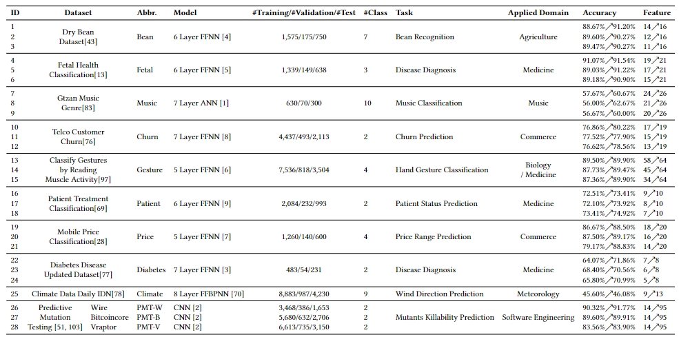
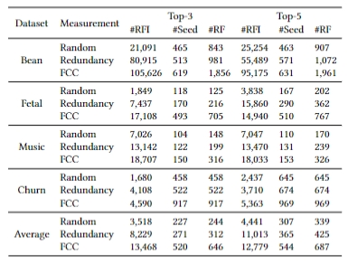
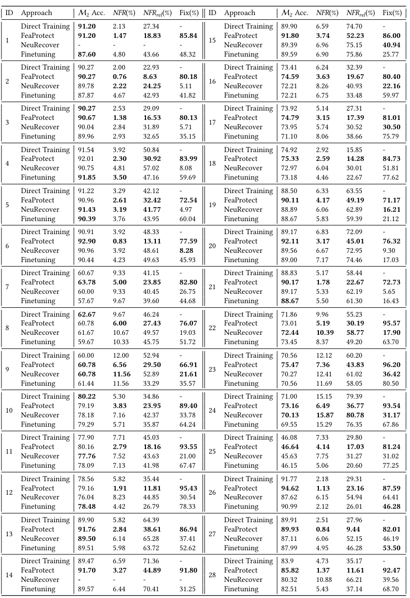
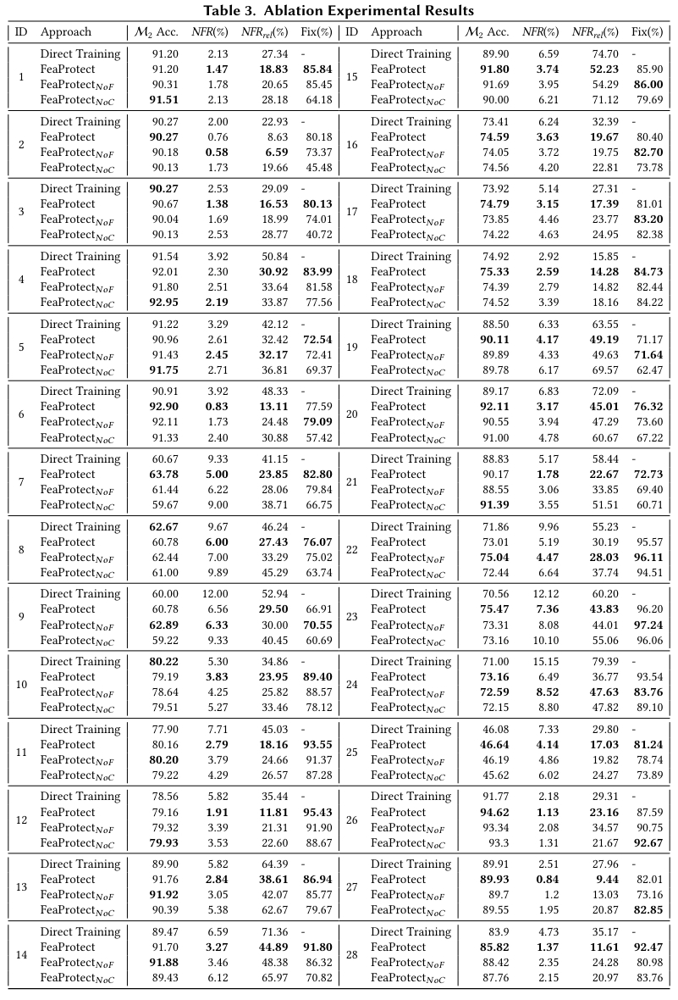
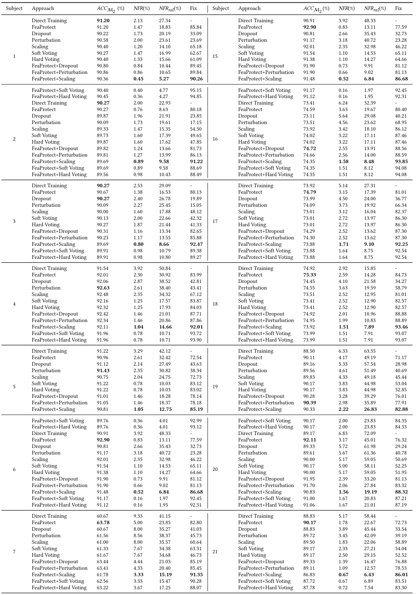
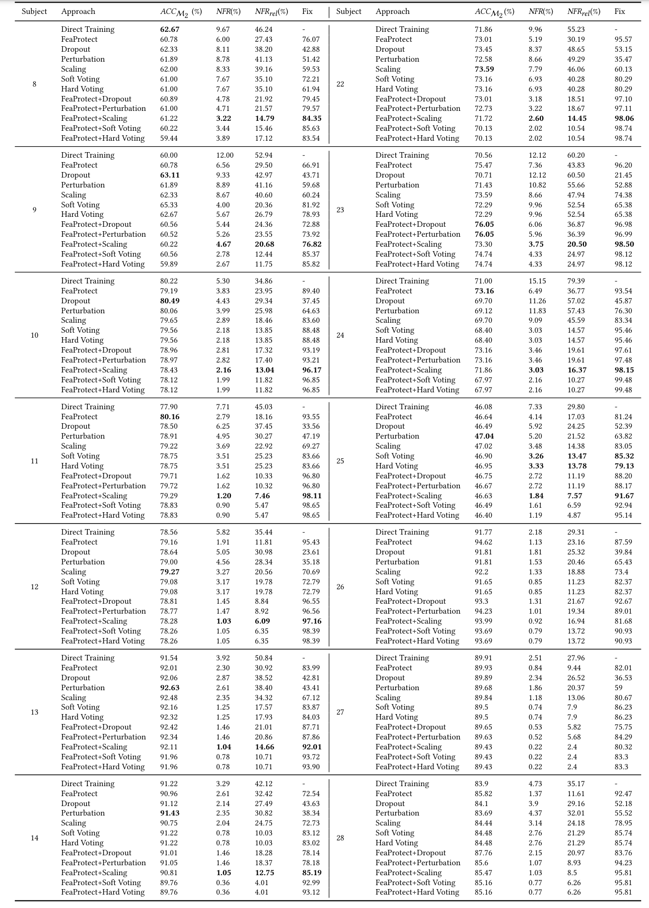

# FeaProtect
## Contents
This repository provides the code, models, datasets, and comprehensive experimental results of our study and evaluation process of FeaProtect.

## Description

Deep learning (DL) systems have been widely utilized across various domains. However, the evolution of DL systems can result in regression faults. In addition to the evolution of DL systems through the incorporation of new data, feature evolution, such as the addition of new features, is also common and can introduce regression faults.
In this work, we first investigate the underlying reasons that cause regression faults in feature evolution scenarios, i.e., redundancy and contribution shift. Based on our investigation, we propose a novel mitigation approach called `FeaProtect`, which aims to minimize the impact of these two causes. To evaluate the performance of `FeaProtect`, we conducted an extensive study comparing it with state-of-the-art approaches. The results show that `FeaProtect` outperforms the in-processing baseline approaches, with an average improvement of 50.6\% $\sim$ 56.4\% in terms of regression fault mitigation. We further show that FeaProtect can enhance the effectiveness of state-of-the-art post-processing approaches in mitigating regression faults.  We also
show that FeaProtect can further enhance the effectiveness of mitigating regression faults by integrating with state-of-the-art post-processing approaches.


## The Structure
Here, we briefly introduce the usage/function of each directory: 

```
├─drfuzz
│  ├─autoencoder (the VAE-based Fidelity Assurance Technique (the Tvae structure and prediction code))
│  │  ├─ctgan (Code for Tvae)
│  │  ├─data (Dataset for Tvae)
│  │  ├─model (The trained tvae model)
│  │  ├─util
│  │  └─train_tvae.py (Train Tvae method)
│  ├─coverages (baseline coverages and the input evaluation to calculate the diversity in `DRFuzz`)
│  ├─dataset
│  ├─models (the original models and its regression model. (Since the file size of some models are large, here we provide all the models and regression model on mobile_price for the reproduction))
│  ├─params (some params of `DRFuzz` and each model/datasets)
│  ├─src (the main algorithm of `DRFuzz` & The experimental script)
│  └─utils
│─FeaProct
│  ├─dataset (the dataset used in `FeaProct`)
│  ├─models (the original models and its regression model. (Since the file size of some models are large, here we provide all the models and regression model on mobile_price for the reproduction))
│  ├─params (some params of `FeaProct` and each model/datasets)
│  ├─src
│  ├─utils
│  │  ├─expect_grad_ops_util.py (calculate the expected gradient)
│  │  ├─logger.py (log the information)
│  │  ├─params_util.py (load the params)
│  │  ├─struct_util.py 
│  ├─test.py (the main validation scripts)
│  └─main.py (the main algorithm of `FeaProct` & The experimental script)

```

## Datasets/Models
we selected 28 subjects for experimentation, including 24 manually
constructed scenarios for simulation and four practical scenarios. These datasets were
obtained from a variety of tasks, including price prediction and disease diagnosis.
In this repository, we have included several models and datasets. 
Due to the large scale of our study and our experiments, which involved 28 subjects, 
we have chosen to provide models and datasets specifically for Mobile Price Prediction tasks for replication. 

Due to the sheer size of the datasets and trained models used in our research, we are unable to include them directly in this repository. However, we will make them available for download on Baidu Drive.



## The Requirements:

- python==3.8

- tensorflow==2.3.0

- pytorch==1.13.0

- pandas

- minepy

- rdt

Please note that PyTorch and RDT are the packages required for Tave.

You can directly use the script below. You can choose to use _pip_ or _conda_ in the script.

~~~
conda create -n Feaproct python=3.8
conda install numpy=1.21.5
conda install tensorflow==2.3.0
conda install matplotlib
conda install pandas
pip install minepy
conda install pytorch==1.13.0 torchvision==0.14.0 torchaudio==0.13.0 pytorch-cuda=11.7 -c pytorch -c nvidia
conda install -c conda-forge rdt
~~~

## Reproducibility

### Environment

**Step 0:** Please install the above runtime environment.

**Step 1:** Clone this repository. Download the dataset and models from OneDrive. 

### Running DRFuzz

The `DRFuzz` artifacts are well organized, and researchers can simply run `DRFuzz` with the following command.

~~~
python main.py --dataset mobile_price --model mobile_price --params_set Dnn mobilePrice change drfuzz --output_name price_range --dataset_col sc_h-talk_time-touch_screen-battery_power-four_g-three_g --terminate_type time --choose_col_type random --time 360 --update_col_num 3
~~~

main.py contains all the configurations for our experimentation.

You can refer to Drfuzz for configuration. 

`--update_col_num` refers to the number of columns selected

`--output_name` refers to the label column of the dataset

`--dataset_col` refers to scenarios

`--choose_col_type` refers to the selection strategy for the number of columns selected

### Running Feaprotect

The `Feaprotect` artifacts are well organized.

The models obtained by our three repeated experiments are `eg_discrt_fea_sel_1`, `eg_discrt_fea_sel_2`, and `eg_discrt_fea_sel_3`. You can use the following command to reproduce the results of the paper.

~~~
python test.py --dataset mobile_price --model mobile_price --num_classes 4 --dataset_col sc_h-talk_time-touch_screen-battery_power-four_g-three_g --fix_type eg_discrt_fea_sel_1 --rf  --need_eg --need_fea_Sel
~~~

The models obtained from the RQ2 ablation experiments are `eg_1`, `eg_2`, `eg_3`, `discrt_fea_sel_1`, `discrt_fea_sel_2`, and `discrt_fea_sel_3`
, respectively
~~~
python test.py --dataset mobile_price --model mobile_price --num_classes 4 --dataset_col sc_h-talk_time-touch_screen-battery_power-four_g-three_g --fix_type eg_1 --rf --need_eg
~~~

~~~
python test.py --dataset mobile_price --model mobile_price --num_classes 4 --dataset_col sc_h-talk_time-touch_screen-battery_power-four_g-three_g --fix_type discrt_fea_sel_1 --rf  --need_fea_Sel
~~~

-----
If researchers need to experiment with our method, researchers can simply run `Feaprotect` with the following command.

~~~
python main.py --dataset <datasetname> --model <datasetname> --num_classes <number of class> --dataset_col <scenarios> --fix_type eg_discrt_fea_sel --need_eg --need_fea_Sel --lamb 0.5
~~~

main.py contains all the configurations for our experimentation.

`--num_classes` refers to the number of classes of the dataset

`--dataset_col` refers to scenarios

`--fix_type` refers to the saved path

`--rf` refers to whether to use the regression error. if Ture, You can use these to calculate the regression error fix rate

`--need_eg` refers to whether to use the expected gradient

`--need_fea_Sel` refers to whether to use the feature selection


Again, you can experiment with the script we provided shell script.

## Additional Results

### study

The overall result is saved here named `study.png` 




### RQ1 

The overall result is saved here named `RQ1_result.png` due to the limited paper space.


### RQ2

The overall result is saved here named `RQ2_result.png` due to the limited paper space.


### RQ3

The overall result is saved here named `RQ3_result.png` due to the limited paper space. Given the extensive number of the experiments, we have divided the table into two separate tables to facilitate your review. Please refer to these tables for a comprehensive understanding of the results.





